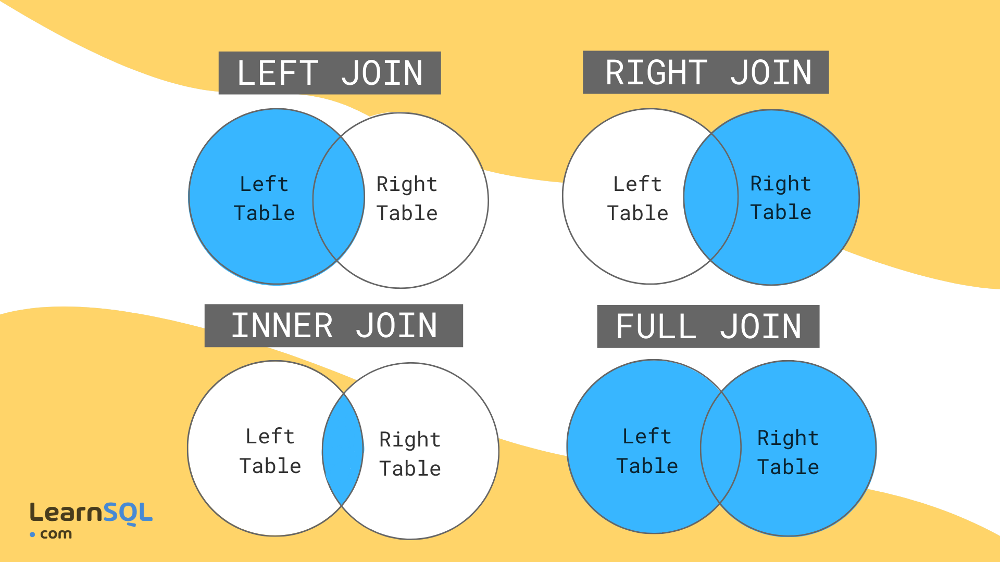

# 📚 Lesson 1.5: SQL Advanced — Joins, Window Functions & CTEs

## Session Overview

| | |
|---|---|
| **Duration** | 3 hours |
| **Format** | Flipped Classroom + Hands-On SQL in DbGate |
| **Tools** | DuckDB + DbGate |
| **Database** | `db/unit-1-5.db` |

## Agenda

| Time | Part | Topic |
|------|------|-------|
| 0:00 – 0:55 | Part 1 | The Map and the Bridge — Meta Queries, Joins & Unions |
| 0:55 – 1:00 | Break | — |
| 1:00 – 1:55 | Part 2 | The Moving Window — Window Functions |
| 1:55 – 2:00 | Break | — |
| 2:00 – 2:55 | Part 3 | Nested Logic — Subqueries & CTEs |

## 🎯 Learning Objectives

By the end of this session, you will be able to:

1. Navigate database schemas using Meta Queries.
2. Combine data using 4 Join types and Unions.
3. Calculate running totals and rankings without losing row detail using window functions.
4. Simplify complex logic using Common Table Expressions (CTEs).

---

## 🏃 Part 1: The Map and the Bridge (55 min)

### Concept Overview

**The Analogy:** Imagine you are at a party. You have a list of names (client) and a list of who brought which gift (claim).

- **Inner Join:** Only people at the party who brought a gift.
- **Left Join:** Everyone at the party; if they didn't bring a gift, the "gift" column is just an empty box (NULL).
- **Union:** Putting two lists of names (e.g., Employees and Contractors) into one long "Staff" list.

### 🛠️ Workshop

Open DbGate and create a new connection to `db/unit-1-5.db`.

**"Before we build the bridge, we need to know the terrain. Let's look at our 'Card Catalog'."**

#### List and Describe Tables

To list all the tables in `main`:

```sql
SHOW TABLES;
```

You should see 4 tables: `address`, `car`, `claim`, `client`.

For more details:

```sql
SHOW ALL TABLES;
```

To view the schema of an individual table:

```sql
DESCRIBE address;
```

👋 **Exercise 1:** Describe the other 3 tables. Study their column names and data types.

#### Summarize Tables

```sql
SUMMARIZE address;
```

👋 **Exercise 2:** Summarize the other 3 tables. Study their min, max, approx_unique, avg and std (if applicable).

#### Joins and Unions

The ERD of the database:

```dbml
Table claim {
  id int [pk]
  claim_date varchar
  travel_time int
  claim_amt int
  motor_vehicle_record int
  car_id int
  client_id int
}

Table car {
  id int [pk]
  resale_value int
  car_type varchar
  car_use varchar
  car_manufacture_year int
}

Table client {
  id int [pk]
  first_name varchar
  last_name varchar
  email varchar
  phone varchar
  birth_year int
  education varchar
  gender varchar
  home_value int
  home_kids int
  income int
  kids_drive int
  marriage_status varchar
  occupation varchar
  address_id int
}

Table address {
  id int [pk]
  country varchar
  state varchar
  city varchar
}

Ref: claim.car_id > car.id
Ref: claim.client_id > client.id
Ref: client.address_id > address.id
```


`car_id`, `client_id`, and `address_id` are foreign keys.

##### How a JOIN actually works

A JOIN is like a zipper. Each table is one side; the `ON` clause is the row of teeth deciding which pairs lock together. `ON claim.car_id = car.id` says: match a claim to a car whenever the claim's car_id equals that car's id. An INNER JOIN keeps only teeth that lock on both sides; a LEFT JOIN keeps every tooth on the left even when the right has nothing to lock onto (those gaps appear as NULL).

Here's a tiny example. Two mini tables:

**claim** (left)

| id | car_id | claim_amt |
|----|--------|-----------|
| 1 | 10 | 500 |
| 2 | 11 | 300 |
| 3 | 99 | 200 |

**car** (right)

| id | car_type |
|----|----------|
| 10 | SUV |
| 11 | Sedan |
| 12 | Van |

`INNER JOIN ... ON claim.car_id = car.id` — only matching rows survive (claim 3 has no car 99; car 12 has no claim):

| claim.id | car_id | claim_amt | car_type |
|----------|--------|-----------|----------|
| 1 | 10 | 500 | SUV |
| 2 | 11 | 300 | Sedan |

`LEFT JOIN` — every claim survives, with NULL where no car matches:

| claim.id | car_id | claim_amt | car_type |
|----------|--------|-----------|----------|
| 1 | 10 | 500 | SUV |
| 2 | 11 | 300 | Sedan |
| 3 | 99 | 200 | NULL |

**The 4 common types of joins:**

- Inner join
- Left join
- Right join
- Full (Outer) join

An overview of the different types of joins:



##### Inner Join

Returns only the rows that match in both tables.

```sql
SELECT *
FROM claim
INNER JOIN car ON claim.car_id = car.id;
```

You can also use the `JOIN` keyword instead of `INNER JOIN`. They are the same. But it's good practice to use `INNER JOIN` to make your query more readable.

> Inner join claim and client.
>
> Inner join client and address.

##### Left Join

Returns all rows from the left table, and the matching rows from the right table.

```sql
SELECT *
FROM claim
LEFT JOIN car ON claim.car_id = car.id;
```

##### Right Join

Returns all rows from the right table, and the matching rows from the left table.

```sql
SELECT *
FROM claim
RIGHT JOIN car ON claim.car_id = car.id;
```

##### Full (Outer) Join

Returns all rows from both tables.

```sql
SELECT *
FROM claim
FULL JOIN car ON claim.car_id = car.id;
```

> Return a joined table containing `id, claim_date, travel_time, claim_amt` from claim, `car_type, car_use` from car, `first_name, last_name` from client and `state, city` from address.

##### Union

A union combines the results of two or more queries into a single result set. The queries must have the same number of columns and compatible data types.


It is not applicable for this database, but assuming we have an employees table with the following columns:

- id
- name
- email
- phone

And a contractors table with the same columns. We can use a union to combine the two tables: 
**Note: the following code is to show the syntax only**

`UNION` removes duplicate rows. Use `UNION ALL` to keep duplicates.

```sql
-- Example syntax (not for this database)
SELECT * FROM employees
UNION
SELECT * FROM contractors;
```

> **Question:** "If I SUMMARIZE the claim table and see a max(claim_amt) that is 10x higher than the average, what does that tell you about our insurance risk?"

👋👋👋 **Group Exercise 3:**

Create a master report of every claim. Include the client's name, their car type, and the city they live in.

> Hint: You will need to join 4 tables.

**Don't try to write all four joins in one go.** Build it up: join two tables first, check the result, then add the third — like assembling a zipper one section at a time. For example, here's the 3-table intermediate step (claim + car + client), which you can run and inspect before adding `address`:

```sql
SELECT
  cl.id, cl.claim_date, cl.claim_amt,
  c.car_type,
  cli.first_name, cli.last_name
FROM claim cl
INNER JOIN car c ON cl.car_id = c.id
INNER JOIN client cli ON cl.client_id = cli.id;
```

Once that looks right, add one more `INNER JOIN` to bring in the city.

<details>
 <summary>Solution for Exercise 3</summary>

**Why 4 joins?** The information we need lives in 4 separate tables — the claim details are in `claim`, the car type is in `car`, the client's name is in `client`, and the city is in `address`. Think of each JOIN as walking from one filing cabinet to the next, using the ID on the current folder to locate the matching folder in the next cabinet.

The chain is: `claim` → find the car (`car_id`) → find the client (`client_id`) → find the client's address (`address_id`). We use `INNER JOIN` throughout because we only want claims that have a complete, matched record in every table — a claim with no car on record wouldn't be useful in this report.

```sql
SELECT
  cl.id, cl.claim_date, cl.claim_amt,
  c.car_type,
  cli.first_name, cli.last_name,
  a.city, a.state
FROM claim cl
INNER JOIN car c ON cl.car_id = c.id
INNER JOIN client cli ON cl.client_id = cli.id
INNER JOIN address a ON cli.address_id = a.id;
```

</details>

### 💬 Reflection

- When joining tables, which table should you choose as the "Left" table? What is a useful rule of thumb?
- How would a "Full Outer Join" help us find cars that have never been claimed AND claims that (erroneously) don't have a car attached?

---

## 🏃 Part 2: The Moving Window (55 min)

### Concept Overview

**The Analogy:**

A standard `GROUP BY` is like asking "What is the average height of this class?" and only writing down one line: "Class average height is 1.73 m." You no longer see any individual students.

A **window function** is like keeping every student in the list, but adding extra notes beside each one — "class average height is 1.73 m" or "you are the 2nd tallest in your class" — while all the original student rows stay visible.

**Why this matters:** In reporting you often need *both* — the individual row AND the group context. For example: "Show me each claim, and also how it compares to the average for its car type." `GROUP BY` can only give you one or the other. Window functions give you both in the same row.

---

> ### 🔤 Plain-English Jargon Buster
>
> | Technical term | What it actually means |
> |---|---|
> | **Window** | The set of rows the function "looks at" when calculating. You define the window with `OVER (...)`. |
> | **PARTITION BY** | "Start a fresh calculation for each group." Like telling Excel to reset the sum counter every time the car type changes. Without it, you'd get one big total for everything. |
> | **ORDER BY** (inside OVER) | "Walk through the rows in this order as you calculate." Required for running totals — the order determines which rows have been "seen" so far. |
> | **Collapsing rows** | What `GROUP BY` does — it merges many rows into one summary row per group. Window functions never collapse; every original row survives. |
> | **RANK()** | Gives each row a position (1st, 2nd, 3rd…). If two rows tie, they share a rank and the next rank is skipped — two rows at rank 2 means the next is rank 4, not rank 3. |
> | **QUALIFY** | A filter that runs *after* the window function is calculated. You can't use `WHERE` on a window result (WHERE runs too early, before the window is computed), so `QUALIFY` fills that gap. |

---

### 🛠️ Workshop

#### Running Total

A running total is a cumulative sum: each row shows the sum of all rows from the start up to that row, in a defined order.

| row | claim_amt | running_total |
|-----|-----------|---------------|
| 1 | 100 | 100 |
| 2 | 50 | 150 |
| 3 | 200 | 350 |
| 4 | 25 | 375 |

```sql
SELECT
  id, claim_amt,
  SUM(claim_amt) OVER (ORDER BY id) AS running_total
FROM claim;
```

**Why add `PARTITION BY`?** Without it, the running total just keeps growing across *all* cars — claims from Car A and Car B pile into the same counter. That's rarely what you want. `PARTITION BY car_id` says: "Reset the counter each time the car_id changes." Think of it as separate bank accounts — each car has its own running balance.

```sql
SELECT
  id, car_id, claim_amt,
  SUM(claim_amt) OVER (PARTITION BY car_id ORDER BY id) AS running_total
FROM claim;
```

> Return a table containing `id, car_id, claim_amt, running_total` from claim, where `running_total` is the running sum of the `claim_amt` column for each `car_id`.

👋 **Exercise 4:** Calculate a running total of insurance payouts over time (ordered by claim_date).

<details>
 <summary>Solution for Exercise 4</summary>

```sql
SELECT
  claim_date, claim_amt,
  SUM(claim_amt) OVER (ORDER BY claim_date) AS running_total
FROM claim;
```

</details>

#### Rank

`RANK()` gives each row a position (1st, 2nd, 3rd, …) within a group, allowing ties to share the same rank and leaving gaps after ties.

Sample table:

| claim\_id | car\_id | claim\_amt |
| ----: | ----: | ----: |
| 1 | A | 1000 |
| 2 | A | 800 |
| 3 | A | 800 |
| 4 | A | 500 |

```sql
SELECT
  id, car_id, claim_amt,
  RANK() OVER (PARTITION BY car_id ORDER BY claim_amt DESC) AS rank
FROM claim;
```

Result:

| claim\_id | car\_id | claim\_amt | amt\_rank |
| ----: | ----: | ----: | ----: |
| 1 | A | 1000 | 1 |
| 2 | A | 800 | 2 |
| 3 | A | 800 | 2 |
| 4 | A | 500 | 4 |

Ties get the same rank, and the next rank after a tie skips accordingly (e.g., two rows tied at rank 2 are followed by rank 4).

There is a close cousin: `ROW_NUMBER()`. RANK() lets ties share a place and skips the next number; ROW_NUMBER() forces a strict 1,2,3 even on ties — like locker numbers, no two people can share one.

#### Qualify

**Why does `QUALIFY` exist?** You might think you can just use `WHERE rank = 1` to filter by rank — but `WHERE` runs *before* the window function is calculated, so the rank column doesn't exist yet when WHERE tries to use it. `QUALIFY` is a special filter that runs *after* window functions, solving exactly this problem. Think of it as a "post-calculation filter."

The `QUALIFY` clause filters rows based on window function results. For example, to find the highest claim per car type:

```sql
SELECT
  cl.id,
  c.car_type,
  cl.claim_amt,
  RANK() OVER (
    PARTITION BY car_type
    ORDER BY claim_amt DESC
  ) AS rank
FROM
  claim cl
  JOIN car c ON cl.car_id = c.id
QUALIFY rank = 1
ORDER BY
  cl.claim_amt DESC;
```

### 💬 Reflection

- What is the key difference between `GROUP BY` and window functions?
- When would you use `RANK()` vs. `ROW_NUMBER()`?

---

## 🏃 Part 3: Nested Logic — Subqueries & CTEs (55 min)

### Concept Overview

**The Analogy:**

A Subquery is like a "thought within a thought."

A CTE (Common Table Expression) is like writing down a recipe step before you start cooking — it makes the code readable for humans, not just machines.

### 🛠️ Workshop

#### Subqueries

A subquery is a query nested inside another query.

To find the cars that have been involved in a claim:

```sql
SELECT id, resale_value, car_type
FROM car
WHERE id IN (
  SELECT DISTINCT car_id
  FROM claim
);
```

**Correlated Subquery** — the inner query references the outer query:

To find the cars that have been involved in a claim, and the claim amount is greater than 10% of the car's resale value:

```sql
SELECT id, resale_value, car_type
FROM car c
WHERE id IN (
  SELECT DISTINCT car_id
  FROM claim
  WHERE claim_amt > 0.1 * c.resale_value
);
```

**EXISTS operator:** - to check if a subquery returns any rows.

To find the cars that have been involved in a claim:

```sql
SELECT id, resale_value, car_type
FROM car c1
WHERE EXISTS (
  SELECT DISTINCT car_id
  FROM claim c2
  WHERE c2.car_id = c1.id
);
```

**Subquery in FROM** (derived table):

```sql
SELECT car_id, avg_claim_amt
FROM (
  SELECT car_id, AVG(claim_amt) AS avg_claim_amt
  FROM claim
  GROUP BY car_id
) AS avg_claims
WHERE avg_claim_amt > (
  SELECT AVG(claim_amt)
  FROM claim
);
```

#### Common Table Expressions (CTEs)

A CTE is a temporary named result set created within a query. Use CTEs when you need to reference the same query multiple times, or to improve readability.

```sql
WITH avg_claims AS (
  SELECT car_id, AVG(claim_amt) AS avg_claim_amt
  FROM claim
  GROUP BY car_id
)
SELECT car_id, avg_claim_amt
FROM avg_claims
WHERE avg_claim_amt > (
  SELECT AVG(claim_amt)
  FROM claim
);
```

Multiple CTEs in one query:

```sql
WITH avg_claims AS (
  SELECT car_id, AVG(claim_amt) AS avg_claim_amt
  FROM claim
  GROUP BY car_id
),
overall_avg AS (
  SELECT AVG(claim_amt) AS overall_avg
  FROM claim
)
SELECT car_id, avg_claim_amt
FROM avg_claims
WHERE avg_claim_amt > (SELECT overall_avg FROM overall_avg);
```

👋👋👋 **Group Exercise 5:** Create a CTE that finds the total claim amount for each car. Then use this CTE to find the cars with a total claim amount greater than the average.

<details>
 <summary>Solution for Exercise 5</summary>

**Why a CTE instead of just a subquery?** Because we need the same grouped data *twice* — once to compare each car's total against the average, and once to display the total in the output. Without a CTE you'd have to write the same `GROUP BY` query twice (once inside WHERE, once in the SELECT). The CTE lets you write it once, give it a name (`total_claims`), and reuse it in both places. This is the core reason CTEs exist: write once, reference many times.

**Why aggregate first, then compare?** We have to know the total per car *before* we can compare it to the average. SQL executes in a specific order — you can't filter on a total in the same step that calculates it. The CTE resolves this by separating the two steps: Step 1 (inside the CTE) calculates the totals. Step 2 (the outer SELECT) does the comparison.

```sql
WITH total_claims AS (
  SELECT car_id, SUM(claim_amt) AS total_claim_amt
  FROM claim
  GROUP BY car_id
)
SELECT car_id, total_claim_amt
FROM total_claims
WHERE total_claim_amt > (SELECT AVG(total_claim_amt) FROM total_claims)
ORDER BY total_claim_amt DESC;
```

</details>

👋👋👋 **Group Exercise 6:** Create a report that shows each claim, the client's name, the car type, and the city. Additionally, include a column showing the rank of each claim by claim amount for each car type. Filter to show only the top 3 claims for each car type.

> **💡 Suggested approach — build it in two stages:**
> 1. First, write the 4-table JOIN and add the `RANK()` column — run it and verify the ranking looks right.
> 2. Then, wrap the entire query in a CTE and add `WHERE rank <= 3` in the outer SELECT.
>
> Breaking it into stages means you catch errors early, when you know exactly what changed.

<details>
 <summary>Solution for Exercise 6</summary>

**The strategy — why a CTE here?** We need to rank the claims *and then* filter by rank. The problem: `RANK()` is a window function calculated after the data is assembled, but `WHERE` runs before window functions. This means `WHERE rank <= 3` would fail if placed directly in the main query — the `rank` column doesn't exist when WHERE tries to use it.

The solution: calculate the ranked results inside a CTE, then filter in the outer `SELECT` — which runs after the CTE is already complete. The CTE gives the rank a name so the outer query can reference it.

**Why `PARTITION BY car_type`?** Without it, `RANK()` would rank claims across *all* car types as one giant list. With it, the ranking resets for each car type — so each car type has its own rank 1, rank 2, rank 3.

```sql
WITH ranked_claims AS (
  SELECT
    cl.id,
    cli.first_name,
    cli.last_name,
    c.car_type,
    a.city,
    cl.claim_amt,
    RANK() OVER (PARTITION BY c.car_type ORDER BY cl.claim_amt DESC) AS rank
  FROM claim cl
  INNER JOIN car c ON cl.car_id = c.id
  INNER JOIN client cli ON cl.client_id = cli.id
  INNER JOIN address a ON cli.address_id = a.id
)
SELECT *
FROM ranked_claims
WHERE rank <= 3
ORDER BY car_type, rank;
```

</details>

### 💬 Reflection

- When would you use a CTE instead of a subquery?
- How would a CTE help you identify "problem clients" (those with multiple high-value claims in a short time period)?

---

## 🎯 Wrap-Up

**Key Takeaways:**
1. Joins let you combine data from multiple tables — always identify which table is your primary subject.
2. Window functions add calculated columns (running totals, ranks) without collapsing row detail — unlike `GROUP BY`.
3. CTEs make complex queries readable by breaking them into named, reusable steps.

**Optional Topics for Self Study:**
- Window Functions: `LEAD()`, `LAG()`, `FIRST_VALUE()`, `LAST_VALUE()`
- Advanced CTEs: Recursive CTEs for hierarchical data
- Performance Optimization: Indexing and query optimization techniques

**Next Steps:**
- Complete the [Assignment](./assignment.md).
- Next lesson: Lesson 1.6 introduces NumPy — the numerical foundation of the Python data science stack.
